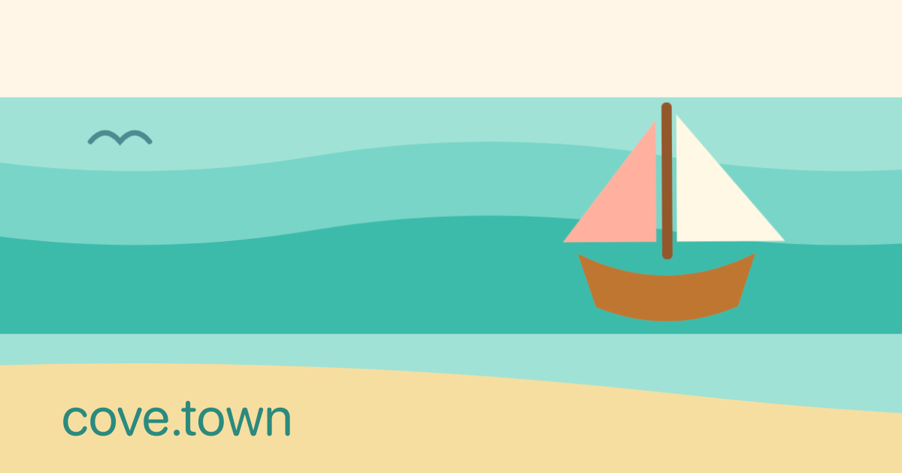

# cove.town

[cove.town](https://cove.town) consists of a PDS, a knot, spindle, and hold, and is fully built on itself. This repo is hosted on the knot, updating a version triggers workflows running on the spindle that build container images hosted on the hold. The accounts that own the services live on the PDS.

## Live services

* PDS - https://pds.cove.town
* Knot - https://knot.cove.town
* Spindle - https://spindle.cove.town
* Hold - https://hold.cove.town
